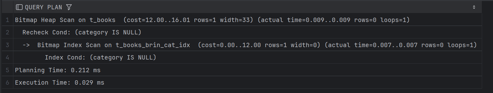
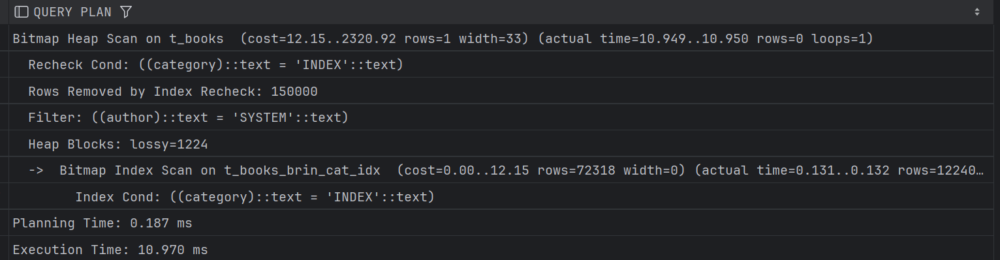
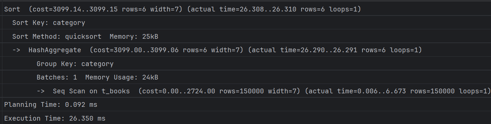
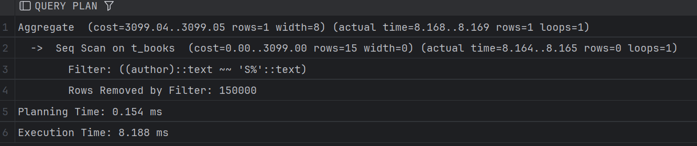
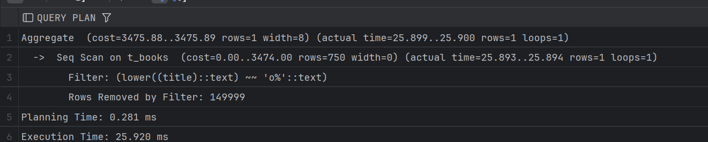
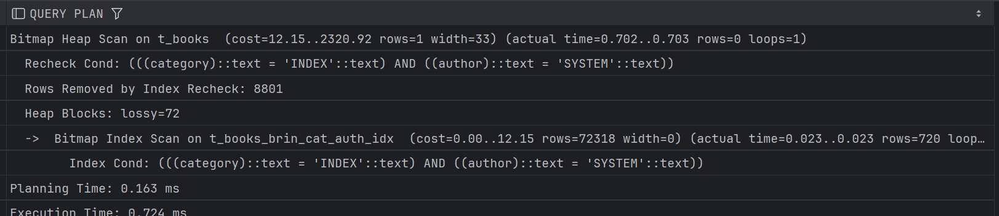

# Задание 1: BRIN индексы и bitmap-сканирование

1. Удалите старую базу данных, если есть:
   ```shell
   docker compose down
   ```

2. Поднимите базу данных из src/docker-compose.yml:
   ```shell
   docker compose down && docker compose up -d
   ```

3. Обновите статистику:
   ```sql
   ANALYZE t_books;
   ```

4. Создайте BRIN индекс по колонке category:
   ```sql
   CREATE INDEX t_books_brin_cat_idx ON t_books USING brin(category);
   ```

5. Найдите книги с NULL значением category:
   ```sql
   EXPLAIN ANALYZE
   SELECT * FROM t_books WHERE category IS NULL;
   ```
   
   *План выполнения:*
   
   
   *Объясните результат:*
   Мы заиспользовали нащ индекс по колонке category, а дальше был битмап скан, в целом ничего такого.

6. Создайте BRIN индекс по автору:
   ```sql
   CREATE INDEX t_books_brin_author_idx ON t_books USING brin(author);
   ```

7. Выполните поиск по категории и автору:
   ```sql
   EXPLAIN ANALYZE
   SELECT * FROM t_books 
   WHERE category = 'INDEX' AND author = 'SYSTEM';
   ```
   
   *План выполнения:*
   
   
   *Объясните результат (обратите внимание на bitmap scan):*
    В данном случае мы использовали оба созданных BRIN индекса для фильтрации по category и author. Сначала Bitmap Index Scan по индексу t_books_brin_cat_idx для выбора строк с category = 'INDEX', а затем был выполнен Bitmap Index Scan по индексу t_books_brin_author_idx для выбора строк с author = 'SYSTEM'. После этого был выполнен Bitmap Heap Scan для получения окончательных результатов.
      
   Цена получилась довольно большой, как и время, не смотря на два индкеса, но это норм для брина, я думаю

8. Получите список уникальных категорий:
   ```sql
   EXPLAIN ANALYZE
   SELECT DISTINCT category 
   FROM t_books 
   ORDER BY category;
   ```
   
   *План выполнения:*
   
   
   *Объясните результат:*
   Мы последовательно отсканировали, т.к тут нам был важен порядок, а также сортировка очень увеличила цену и время, что логично

9. Подсчитайте книги, где автор начинается на 'S':
   ```sql
   EXPLAIN ANALYZE
   SELECT COUNT(*) 
   FROM t_books 
   WHERE author LIKE 'S%';
   ```
   
   *План выполнения:*
   
   
   *Объясните результат:*
    Здесь был сек скан, т.к брин не умеет в префисный поиск.

10. Создайте индекс для регистронезависимого поиска:
    ```sql
    CREATE INDEX t_books_lower_title_idx ON t_books(LOWER(title));
    ```

11. Подсчитайте книги, начинающиеся на 'O':
    ```sql
    EXPLAIN ANALYZE
    SELECT COUNT(*) 
    FROM t_books 
    WHERE LOWER(title) LIKE 'o%';
    ```
   
   *План выполнения:*
   
   
   *Объясните результат:*
    Здесь также был сек скан, т.к индекс по LOWER(title) не может быть использован для префиксного поиска, даже с учетом того что у нас есть индекс на нижний регистр

12. Удалите созданные индексы:
    ```sql
    DROP INDEX t_books_brin_cat_idx;
    DROP INDEX t_books_brin_author_idx;
    DROP INDEX t_books_lower_title_idx;
    ```

13. Создайте составной BRIN индекс:
    ```sql
    CREATE INDEX t_books_brin_cat_auth_idx ON t_books 
    USING brin(category, author);
    ```

14. Повторите запрос из шага 7:
    ```sql
    EXPLAIN ANALYZE
    SELECT * FROM t_books 
    WHERE category = 'INDEX' AND author = 'SYSTEM';
    ```
   
   *План выполнения:*
   
   
   *Объясните результат:*
    Тут у нас получился индекс скан, но цена огромная, 2320, но время в целом всё равно довольно маленькое. Меньше чем было бы при сек скане.