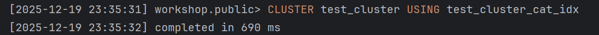
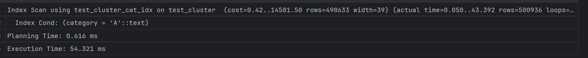

## Задание 3

1. Создайте таблицу с большим количеством данных:
    ```sql
    CREATE TABLE test_cluster AS 
    SELECT 
        generate_series(1,1000000) as id,
        CASE WHEN random() < 0.5 THEN 'A' ELSE 'B' END as category,
        md5(random()::text) as data;
    ```

2. Создайте индекс:
    ```sql
    CREATE INDEX test_cluster_cat_idx ON test_cluster(category);
    ```

3. Измерьте производительность до кластеризации:
    ```sql
    EXPLAIN ANALYZE
    SELECT * FROM test_cluster WHERE category = 'A';
    ```
    
    *План выполнения:*
    
    
    *Объясните результат:*
    Заюзали индекс, но цена большая из-за объема данных, как и время, 133мс это сильно больше чем было до этого

4. Выполните кластеризацию:
    ```sql
    CLUSTER test_cluster USING test_cluster_cat_idx;
    ```
    
    *Результат:*
    

5. Измерьте производительность после кластеризации:
    ```sql
    EXPLAIN ANALYZE
    SELECT * FROM test_cluster WHERE category = 'A';
    ```
    
    *План выполнения:*
    
    
    *Объясните результат:*
    Цена сильно выросла, почти в 2 раза, но время при этом упало также почти в два раза

6. Сравните производительность до и после кластеризации:
    
    *Сравнение:*
    Время упало, т.к у нас данные теперь физически упорядочены. Т.к мы чиатем из памяти страницами, мы не извлекаем лищних данных и вообще у нас всё отлично получается. Однако из-за мета данных мы очень проигрываем в накладных расходах. То есть за счет близости данных мы выйграли по времени, но из-за доп инфы проиграли в цене. Но я думаю что для кейсов где таблица не часто меняется и не надо её постоянно кластеризовать, это очень профитная тема.